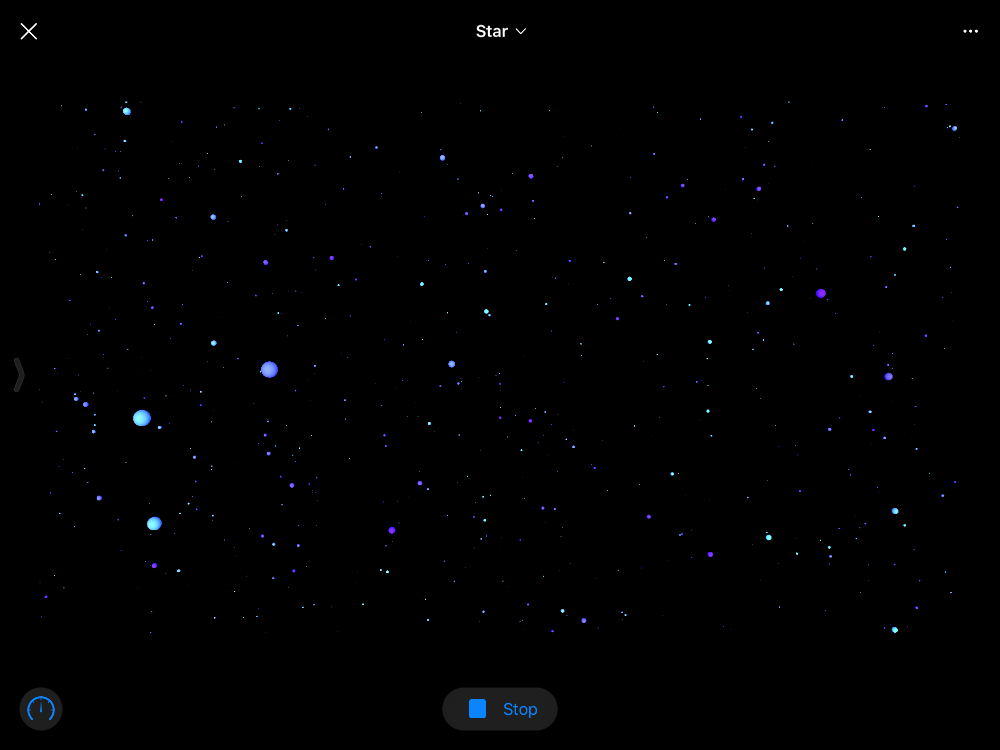

# WWDC-2018-Star-Viewer
This is an application I wrote that won a 2018 WWDC Scholarship from Apple.  Each year Apple hosts a developer competition for students where they can create a swift playground application and submit it for the chance to win a ticket to their world wide developer conference.  They get thousands of submissions each year and select the best 250 as the winners.  This is an augmented reality view of the stellar items present in the milky way.

## Data
All data is from a collection of real stellar objects and comes from the HYG Star Database.  This database combines three seperate archives of stars and is downloaded as a .csv file.  A striped out version of that .csv file exists within this repo.

## Technologies Used
This project was my first real introduction to the apple ecosystem, beyond writing a few off-hand swift scripts here and there.  It was largely a learning experience and I certainly did learn a lot about the following frameworks.

* ARKit
* SceneKit
* UIKit

## Example

## How to Run
In order to run the application you will need an iPad that supports AR and playgrounds.  Then you can just download this repository and air drop the .playground 'file' to your iPad.  You may be able to transfer it over via email if you don't have a mac to air drop.
